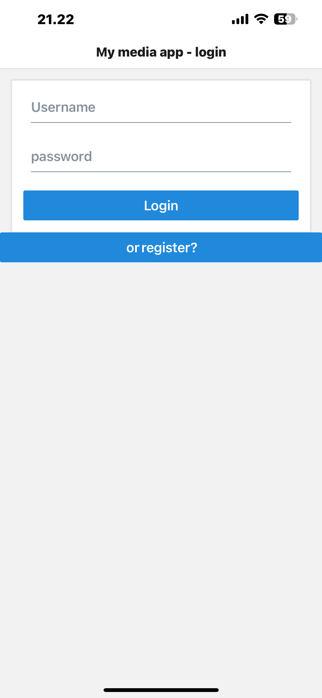
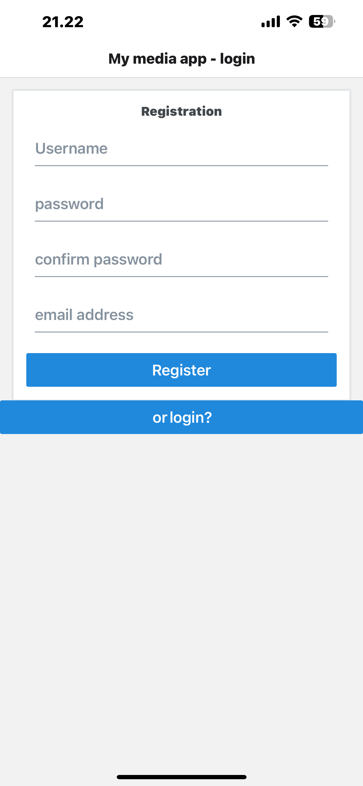
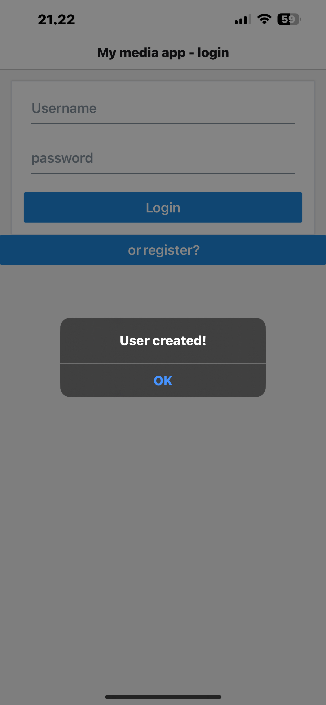
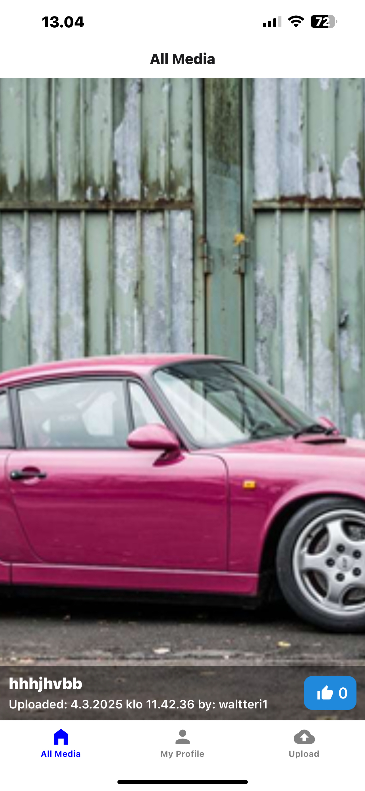
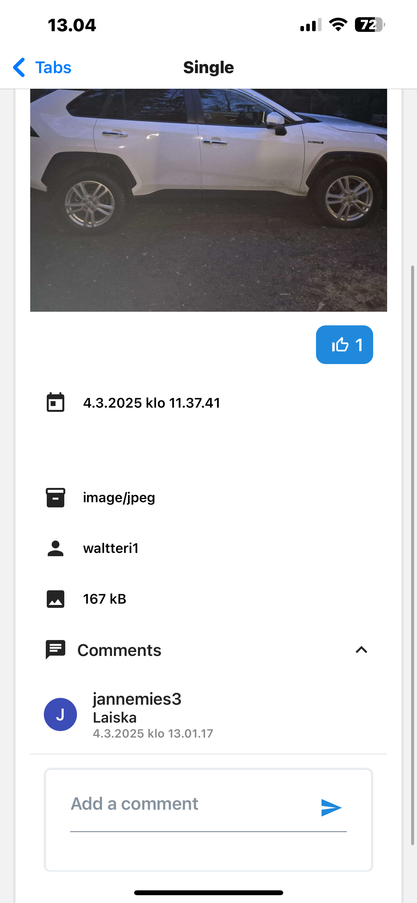
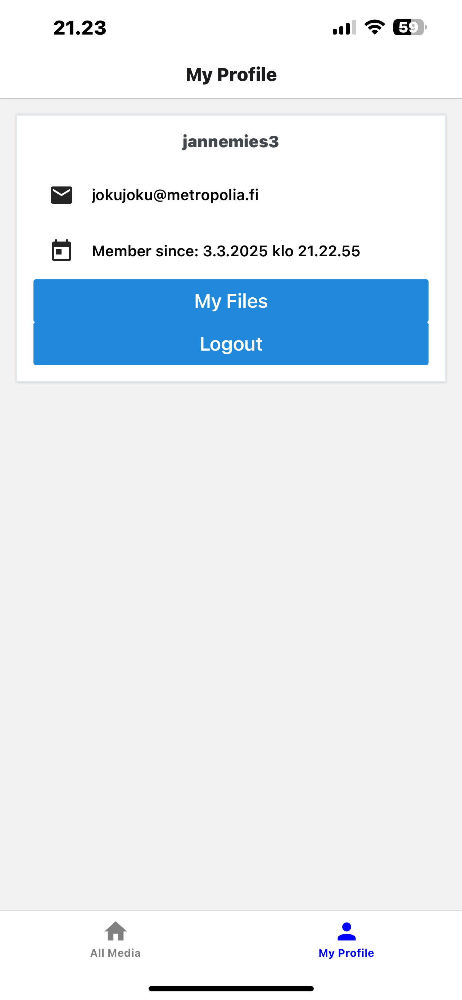
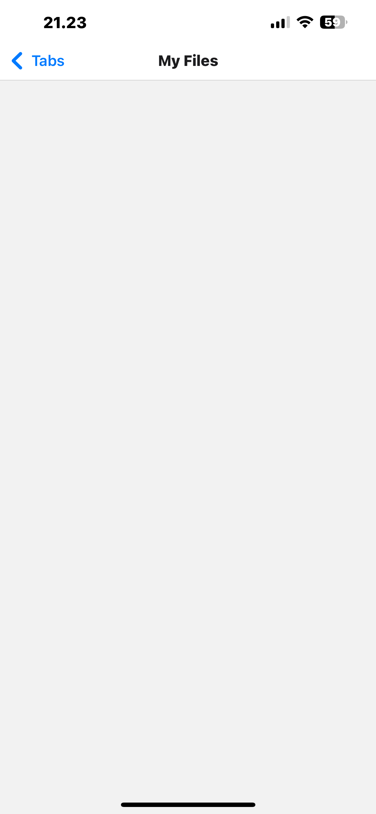
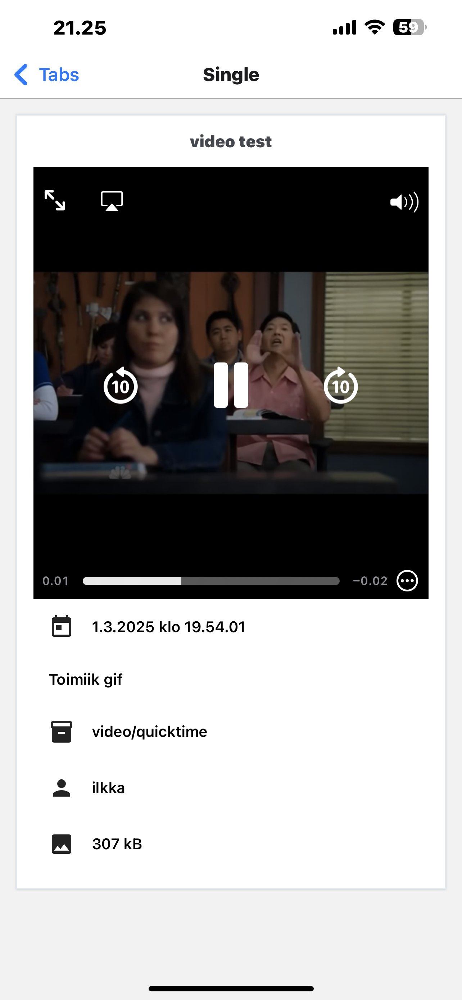
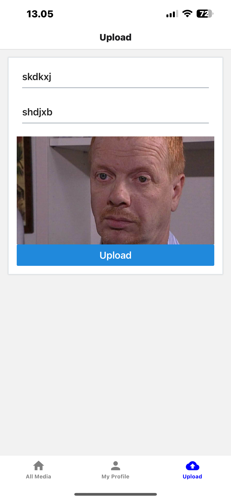

# React Native Assignments

This is the working version of the mobile version of the media-sharing app. It includes various features for uploading, viewing, and interacting with media content.

## Features

- User authentication and profile management
- Media upload and sharing

## Screenshots

### Login Page



### Registration Screen



### User created



### Home Screen



### Single Screen




### My Profile



### My Files



### Single screen of video



## New photo uploaded


### Upload page



### Uploaded photo


## Installation

1. Clone the repository:

   ```sh
   git clone https://github.com/jannepeh/hybrid-react-native-25
   ```

2. Navigate to the project directory

```sh
cd hybrid-react-native-25
```
